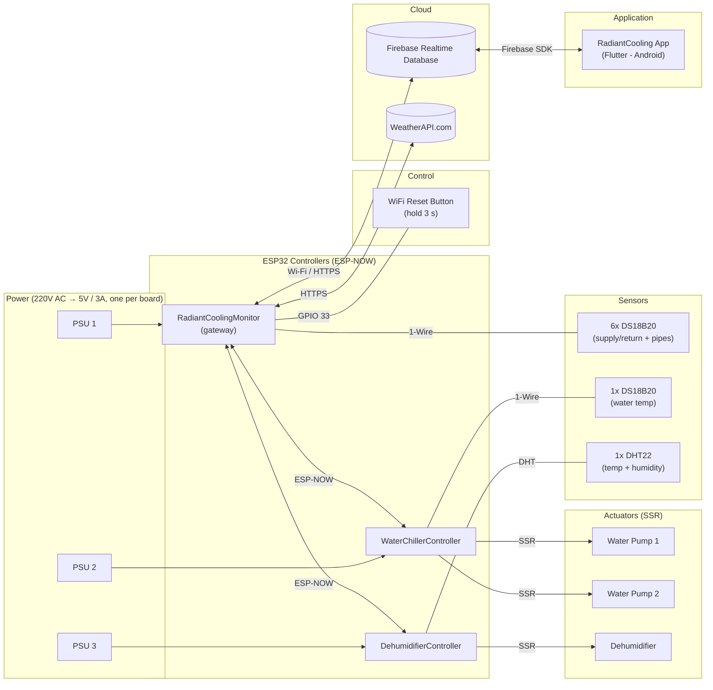

# Block Diagram

> Hardware block diagram of the radiant cooling installation: ESP32 boards
> linked over ESP-NOW, with the gateway board carrying Wi-Fi + Firebase.
> All sensor readings are collected by the gateway and pushed to Firebase.

## Hardware summary

| Board                        | Sensors                              | Actuators (SSR)              | Role     |
| ---------------------------- | ------------------------------------ | ---------------------------- | -------- |
| `RadiantCoolingMonitor`      | 6x DS18B20 (1-Wire)                  | —                            | Gateway  |
| `WaterChillerController`     | 1x DS18B20                           | 2x SSR → 2 water pumps       | Peer     |
| `DehumidifierController`     | 1x DHT22 (temp + humidity)           | 1x SSR → dehumidifier        | Peer     |

## Diagram

## Data flow

1. Each board reads its own sensors.
2. Peers send `telemetry`/`state` to the gateway over ESP-NOW.
3. The gateway combines its 6x DS18B20 readings with peer data and writes
   everything to Firebase (`radiant/telemetry/...`).
4. The app reads from Firebase via the SDK.

## Blocks

| Block                    | Role                | Description                                          |
| ------------------------ | ------------------- | ---------------------------------------------------- |
| `RadiantCoolingMonitor`  | **Gateway**         | Wi-Fi + Firebase + ESP-NOW; reads 6x DS18B20         |
| `WaterChillerController` | ESP-NOW peer        | Reads 1x DS18B20; controls 2 water pumps via 2 SSRs  |
| `DehumidifierController` | ESP-NOW peer        | Reads 1x DHT22; controls dehumidifier via 1 SSR      |
| 6x DS18B20               | Sensor              | Water supply/return + 4 pipe temps above the ceiling (monitor) |
| 1x DS18B20               | Sensor              | Chiller loop water temperature                       |
| 1x DHT22                 | Sensor              | Temperature + humidity for dew-point control         |
| WiFi reset button        | Control             | GPIO 33 → GND; hold 3 s to erase WiFi credentials    |
| Water pumps (2)          | Actuator            | Circulate chilled water (SSR-controlled)             |
| Dehumidifier             | Actuator            | Removes humidity (SSR-controlled)                    |
| Power supplies (3)       | Power               | One 220V→5V/3A supply per board (isolated)           |
| Firebase RTDB            | Cloud               | Shared database for app and firmware                 |
| WeatherAPI.com           | Cloud               | Outdoor dew point + temperature; gateway calls it with the app-managed key |
| `RadiantCooling` app     | App                 | Monitoring and configuration UI (Android)            |

## Notes

- Only the gateway board uses Wi-Fi; peers are Wi-Fi-free (lower power,
  simpler setup).
- All boards must operate on the same Wi-Fi channel for ESP-NOW (see
  `docs/api.md`).
