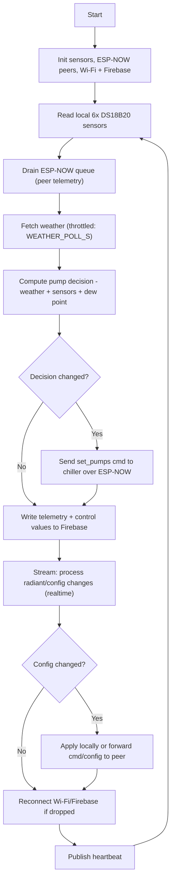
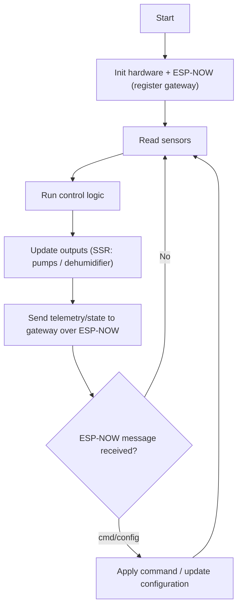
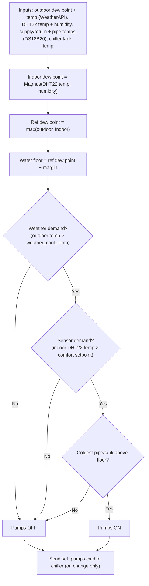
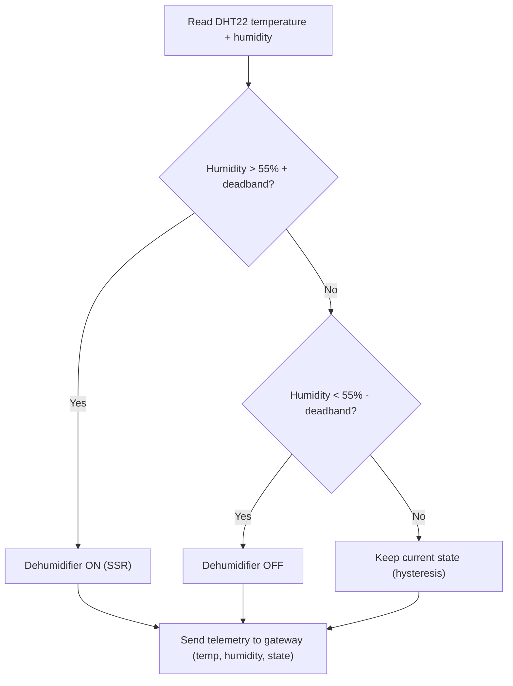

# Flow Charts

> Control logic flows for the ESP32 firmware — matches the implemented code
> in `src/esp/` (the pump decision lives in `ClimateControl.cpp`).

## 1. Main Control Loops

The three boards are split into two roles: the **gateway** (`RadiantCoolingMonitor`, the only board with Wi-Fi + Firebase) and the **ESP-NOW peers** (`WaterChillerController`, `DehumidifierController`).

### 1a. Gateway loop (`RadiantCoolingMonitor`)

### 1b. Peer loop (`WaterChillerController`, `DehumidifierController`)

## 2. Water Pump Control Logic (computed on the gateway)

The pump decision is **not** made on the chiller board — the gateway
(`RadiantCoolingMonitor`) computes it from the WeatherAPI outdoor weather
(API key managed by the app) and all ESP sensor readings, then sends a
`set_pumps` command to the chiller. The chiller board only executes
commands (with a local fail-safe: pumps off if its water sensor is lost).

> Draft thresholds (tunable via `config/control` in Firebase): comfort
> setpoint 24 °C, dew-point margin 2 °C, weather demand above 28 °C,
> hysteresis 1 °C. Hysteresis is applied by comparing against the floor
> ± margin depending on whether the pumps are already running.

## 3. Dehumidifier Control Logic

`DehumidifierController` — holds indoor relative humidity at the **55%**
setpoint (read from its own DHT22), with hysteresis. The humidity reading is
also sent to the gateway for the chiller dew-point computation.

> Setpoint 55 %RH, deadband 5 %RH by default (tunable via `config/dh`).

## Notes

- Hysteresis (deadbands) is applied to all switching logic to prevent SSR
  chatter and short-cycling of the pumps/dehumidifier.
- Fail-safe behaviour (e.g. pump override on sensor failure) is handled
  outside these flows and should be documented per-controller.
