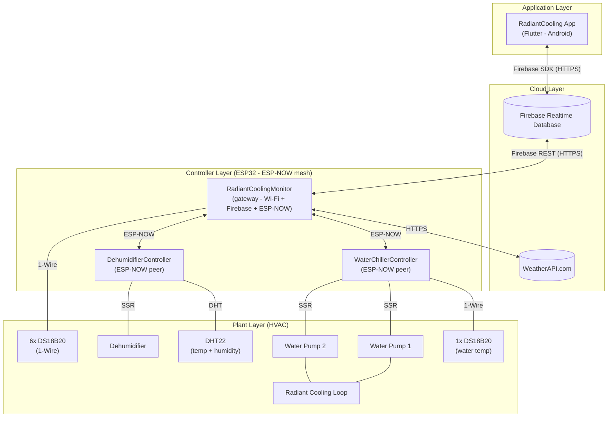

# System Architecture

> High-level view of the Radiant Cooling System: the Flutter app, Firebase
> Realtime Database, the ESP32 mesh (ESP-NOW), and the physical HVAC plant.

## Overview

The system is organized into four logical layers:

| Layer          | Components                                              | Responsibility                                |
| -------------- | ------------------------------------------------------- | --------------------------------------------- |
| Application    | `RadiantCooling` Flutter app (Android)                   | Monitoring, configuration, user interface     |
| Cloud          | Firebase Realtime Database + WeatherAPI.com               | Shared data store; outdoor dew point for control |
| Controllers    | ESP32 — `RadiantCoolingMonitor` (**gateway**), `WaterChillerController`, `DehumidifierController` | Local control loops, sensing, actuation |
| Plant          | Water pumps (2, SSR), dehumidifier (SSR), DS18B20 + DHT22 sensors | Physical HVAC equipment                       |

**Key point:** the three ESP32 boards talk to each other over **ESP-NOW**
(no router or broker needed). Only `RadiantCoolingMonitor` connects to
Wi-Fi and Firebase, acting as the gateway between the mesh and the cloud.

## Diagram

## Data flows

- **Sensors → app:** every board reads its own sensors (gateway: 6x
  DS18B20; chiller: 1x DS18B20; dehumidifier: 1x DHT22). Peers send their
  readings to the gateway over ESP-NOW; the gateway combines everything and
  writes to Firebase; the app reads via the Firebase SDK.
- **Weather → control:** the gateway polls WeatherAPI.com (API key managed
  by the app and delivered via `radiant/config/weather_key`) for the
  outdoor dew point/temperature and computes the chiller pump decision
  (weather + sensors + condensation protection, see
  `docs/diagrams/flow-chart.md`).
- **App → plant:** the app writes `config`/`cmd` in Firebase; the gateway
  detects the change and relays it to the right peer over ESP-NOW.

## Notes

- **Single Wi-Fi channel:** all boards must share the gateway's Wi-Fi
  channel for ESP-NOW to work alongside the router connection.
- The gateway buffers ESP-NOW packets in a FreeRTOS queue and writes to
  Firebase asynchronously — never inside the ESP-NOW callback.
- Interfaces between controllers and plant equipment are detailed in the
  block diagram and schematics.
